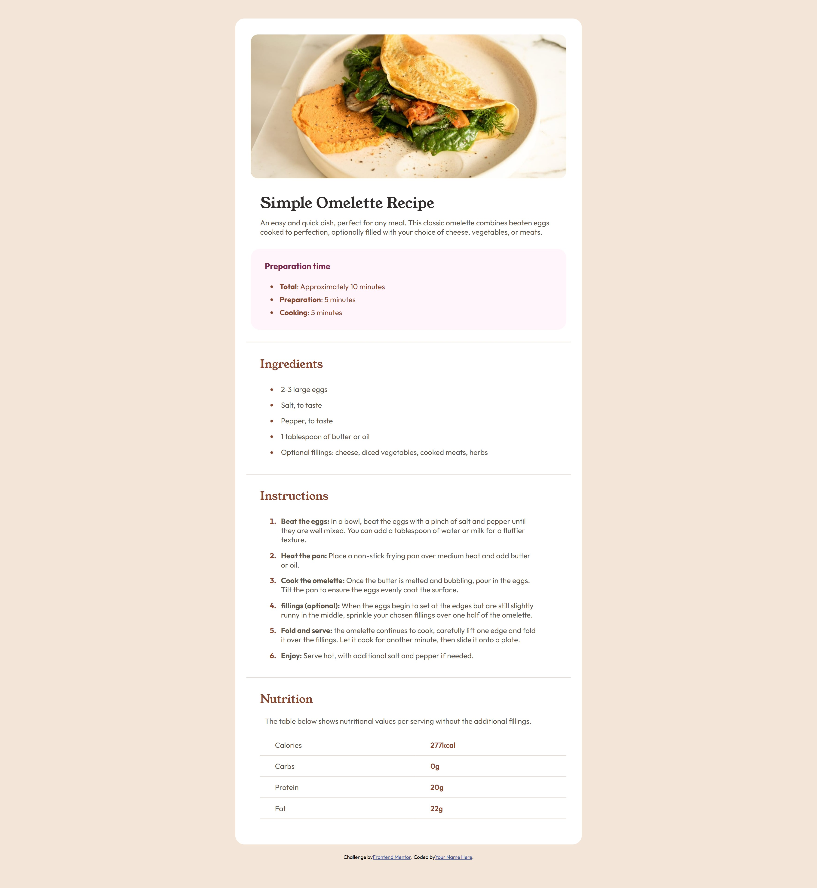
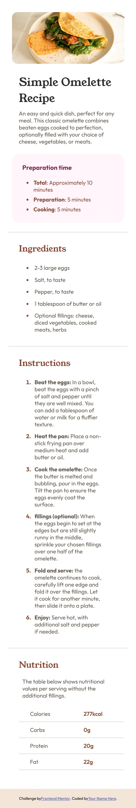

# Frontend Mentor - Recipe page solution

This is a solution to the [Recipe page challenge on Frontend Mentor](https://www.frontendmentor.io/challenges/recipe-page-KiTsR8QQKm). Frontend Mentor challenges help you improve your coding skills by building realistic projects.

## Table of contents

- [Overview](#overview)
  - [The challenge](#the-challenge)
  - [Screenshot](#screenshot)
  - [Links](#links)
- [My process](#my-process)
  - [Built with](#built-with)
  - [What I learned](#what-i-learned)
  - [Continued development](#continued-development)
  - [AI Collaboration](#ai-collaboration)
- [Author](#author)

## Overview

### The challenge

Users should be able to:

- View the optimal layout for the recipe page depending on their device's screen size
- See hover and focus states for all interactive elements on the page

### Screenshot

**Desktop**


**Mobile**



### Links

- Solution URL: [Recipe page solution using Flexbox and responsive design](https://www.frontendmentor.io/solutions/recipe-page-solution-using-flexbox-and-responsive-design-wS3lL7DG8Y)
- Live Site URL: [View live site](https://amalalmutairi0.github.io/recipe-page/)

## My process

### Built with

- Semantic HTML5 markup
- CSS custom properties
- Flexbox
- A `@media (max-width: 480px)` breakpoint for mobile

### What I learned

I ran into an issue where `border-radius` on my image wasn't showing rounded corners even though the value was correct. It turned out I had `padding` on the `img` element itself, which pushed the actual photo away from the rounded edge, so the rounding was applied to empty space instead of the image:

```css
.basis img {
  display: block;
  width: 100%;
  border-radius: 16px;
}
```

I also learned the basics of working with media queries, using `@media` to adjust padding and layout for smaller screens, and checking the page at different widths to catch layout issues.

One of the main challenges I faced was that I built the whole layout first without thinking about different screen sizes, then only added responsiveness after the desktop version was already done. Next time I want to keep screen size differences in mind from the start instead of fixing it at the end.

### Continued development

- Get more comfortable estimating spacing and padding values from static JPG designs, since this challenge didn't include exact pixel measurements.
- Practice adding more breakpoints between mobile and desktop instead of relying on just one.

### AI Collaboration

I used Claude during this project as a learning partner rather than a code generator.

- **How I used it:** I described what I was seeing (screenshots, layout problems) and worked through the reasoning with guiding questions until I found the cause myself.
- **What worked well:** Being asked questions instead of getting the answer directly helped the concepts actually stick.
- **What I'd do differently:** Think about responsiveness earlier in the process instead of only checking mobile at the end.


## Author

- Frontend Mentor - [@AmalAlmutairi0](https://www.frontendmentor.io/profile/AmalAlmutairi0)
- GitHub - [AmalAlmutairi0](https://github.com/AmalAlmutairi0)